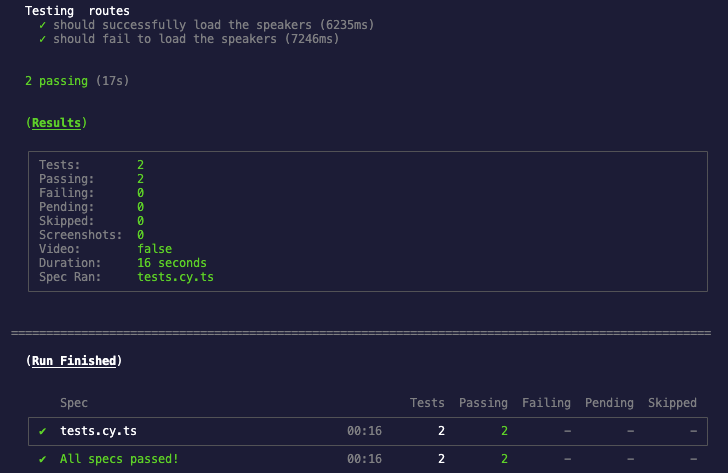

# Take-home Assignment Submission

Thank you for the opportunity to work on this assignment. It was a rewarding experience, and I enjoyed tackling the challenges it presented. Below, I outline my approach, the key decisions I made, and the considerations that influenced my solution.

## Live Demo

You can view the live deployment of my solution here: [Live Demo](https://frontend-test-next.vercel.app/)

## Approach & Key Decisions

### 1. **TailwindCSS Adoption**

Initially, I considered using additional dependencies like Framer Motion, primarily because I was unfamiliar with TailwindCSS. However, after researching and experimenting with the framework, I gained a strong appreciation for its simplicity and utility. Coming from a background of using UI libraries such as MaterialUI, working with TailwindCSS felt refreshing, allowing me to focus on fundamental web development principles while maintaining a clean and efficient design. I did, however, include `react-icons` to easily integrate icons into the UI for improved user experience and navigation.

### 2. **API Implementation with My JSON Server**

The task required fetching a list of speakers from an API. To achieve this, I used [My JSON Server](https://my-json-server.typicode.com/), a tool by Typicode that allows for the quick setup of a fake REST API. It enabled me to simulate a real API by creating a `db.json` file that represents the speaker data. This approach offered a minimal-effort solution that worked seamlessly for this project.

### 3. **Performance Optimization**

A key consideration was performance optimization. I used lazy loading to ensure that components were only loaded when necessary. This technique improved initial load times by loading critical components first and deferring non-essential components until they were needed, resulting in a smoother user experience.

### 4. **End-to-End Testing with Cypress**

Testing was an essential part of the development process. I implemented end-to-end tests using Cypress to ensure that the application worked as expected in various scenarios. Both successful and erroneous routes were tested to guarantee robustness. Below are the steps to run the tests:

## Running Cypress Tests

To run the end-to-end tests:

1. Clone the repository.
2. Install dependencies with `npm install`.
3. To run the tests with the Cypress UI, execute `npx cypress open`.
4. For headless test execution, run `npx cypress run`.
