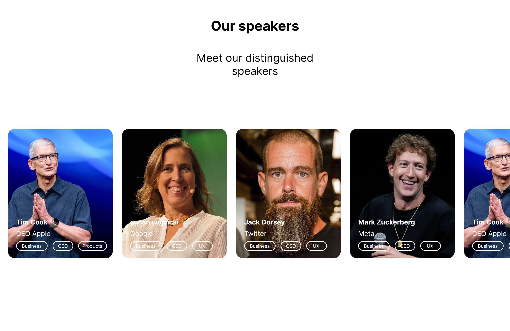

This is a [Next.js](https://nextjs.org) project bootstrapped with [`create-next-app`](https://nextjs.org/docs/app/api-reference/cli/create-next-app).

## Getting Started

First, run the development server:

```bash
npm run dev
# or
yarn dev
# or
pnpm dev
# or
bun dev
```

Open [http://localhost:3000](http://localhost:3000) with your browser to see the result.

You can start editing the page by modifying `app/page.tsx`. The page auto-updates as you edit the file.

This project uses [`next/font`](https://nextjs.org/docs/app/building-your-application/optimizing/fonts) to automatically optimize and load [Geist](https://vercel.com/font), a new font family for Vercel.

## Learn More

To learn more about Next.js, take a look at the following resources:

- [Next.js Documentation](https://nextjs.org/docs) - learn about Next.js features and API.
- [Learn Next.js](https://nextjs.org/learn) - an interactive Next.js tutorial.

You can check out [the Next.js GitHub repository](https://github.com/vercel/next.js) - your feedback and contributions are welcome!

## Your task

You have been given the following mock-up design:



### Part 1 (Tailwind, React)

Your task is to implement the slider component of the design. It has the following requirements:

1. The cards should slide across the screen infinitely.
1. When the user hovers over the cards the cards should slow down to an eventual stop and then resume sliding when the user stops hovering.
1. If a specific card is hovered an interesting and dynamic hover effect should be applied.
1. Clicking on one of the cards should open a modal with a larger version of the card fixed to the center of the screen.
    1. There is no design for the look of this modal so you will have to be creative here.
    1. Bonus points for if you are able to animate the card from its small version to the full version seamlessly.
1. The component should be fully responsive.

### Part 2 (Next.js)

1. The list of items should come from an API. Make user of Next.js route handlers to create a mock route: https://nextjs.org/docs/app/building-your-application/routing/route-handlers
1. The mock route should return a list of the cards.
1. Simulate a long running request by setting a timeout.
1. Create a second route that always returns an error after a few seconds.
1. Call the first route from the client and populate the cards with the data from the API.
1. Call the second (broken) route and demonstrate how your component will gracefully handle the error.

### Technical requirements / considerations

1. Careful consideration should be given to any additional dependencies.
1. The slider component should take in list of items to display as props.
1. Strict typescript types should be in place.
1. Make sure to handle loading and error states correctly.
